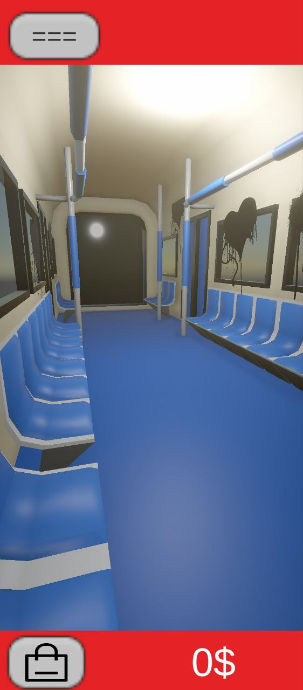
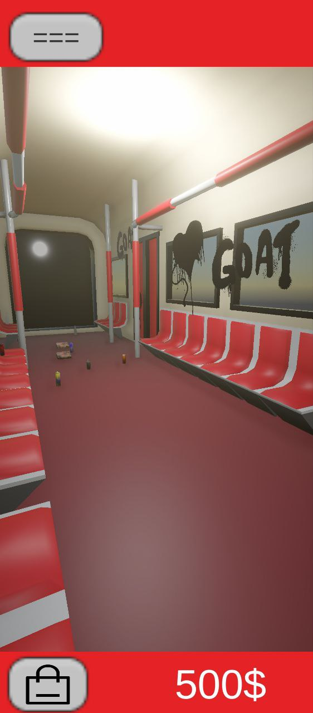
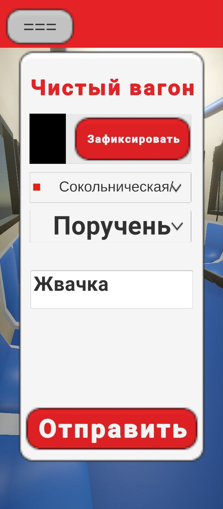
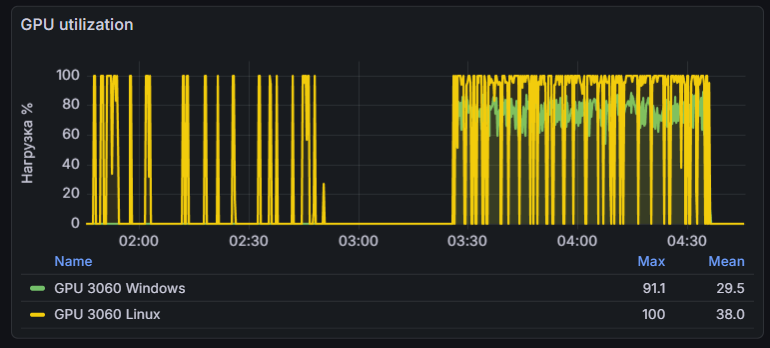

# TMXHakaton

Проект с хакатона ТМХ (ТрансМашХолдинг) — **1-е место**.

Задача: вовлечь пассажиров метро в процесс выявления дефектов вагонов через геймификацию. Решение состоит из пяти частей — мобильного Unity-клиента, Бэкенд сервера, Панели администрации, создание чертежа дрона аналитики вагонов в депо и сервиса генерации синтетического датасета для обучения модели детекции дефектов.

Данный репозиторий отражает только 2 модуля, Unity-клиент и сервис генерации синтетического датасета

```
TMXHakaton/
├── RailwayCarriage/      # Unity-клиент (мобильное приложение)
└── SinteticGenerate/    # Генерация синтетического датасета через Stable Diffusion
```

---

## Railway

Мобильное Unity-приложение. Пассажир фотографирует реальные дефекты вагона — мусор, граффити, поломки — и отправляет репорт. За репорты начисляются монеты, на которые можно улучшить свой виртуальный 3D-вагон: убрать граффити, покрасить, навести порядок.

### Как это работает

Пользователь видит 3D-модель своего вагона. Изначально он загрязнён — случайно расставленный мусор и граффити на стенах. Чтобы его улучшить, нужно отправлять реальные репорты через камеру. Репорты уходят на бэкенд, модераторы обрабатывают, монеты зачисляются. За монеты в магазине убираются дефекты из виртуального вагона.

|  Синий вагон  |  Красный вагон  |  Меню  |
:-------------------------:|:-------------------------:|:-------------------------:
  |    |  

Состояние вагона и баланс хранятся на сервере и синхронизируются при каждом запуске. Оффлайн-репорты накапливаются в очереди и переотправляются при следующем подключении.

### Архитектура клиента

**Инициализация** (`TimeStateGarbage`) — singleton MonoBehaviour, управляет жизненным циклом при запуске:
1. Загрузка локального состояния вагона (мусор + граффити) из JSON
2. Восстановление 3D-объектов в сцене по сохранённым ID и позициям
3. Создание / загрузка пользователя, синхронизация баланса с сервера
4. Переотправка накопленной оффлайн-очереди репортов
5. Генерация нового мусора если прошло 24 часа с последнего запуска

**Хранилища** (`StorageGarbage`, `StorageGraffiti`) — компоненты с пулом GameObject'ов и массивом точек спавна. Спавнят объекты на свободные позиции, восстанавливают сцену по ID при загрузке. Мусор и граффити разделены намеренно: мусор возобновляется каждые 24 часа, граффити убирается только через магазин.

**Персистентность** (`JsonStorageSaver`, `JsonGraffitiSaver`) — сериализация через `JsonUtility` в `Application.persistentDataPath`. Интерфейсы `IStorageSaver` / `IGraffitiSaver` позволяют подменять реализацию.

**Сетевой слой** (`APIClient`, `MetroService`):
- `APIClient` — обёртка над `UnityWebRequest` с async/await через `Task.Yield()`, дефолтными заголовками и таймаутом
- `MetroService` — статический фасад: создание пользователя, синхронизация монет, покупка в магазине, отправка репортов с фото через multipart/form-data
- GPS-координаты прикрепляются к репорту при наличии разрешения

**Оффлайн-очередь** (`PendingReportQueue`) — репорты, не доставленные из-за отсутствия сети, накапливаются локально и переотправляются при следующем запуске.

### Стек

- **Unity** (3D, мобильная сборка)
- **C#** — игровая и сетевая логика
- **UnityWebRequest** + async/await
- **JsonUtility** — сериализация состояния
- **GPS** — геолокация для репортов

### Разделение ответственности

Репозиторий содержит клиентскую часть. Бэкенд (REST API), база данных и панель администратора разрабатывались отдельно сокомандниками.

---

## Generator

Сервис генерации синтетического датасета дефектов вагонов метро для обучения модели детекции.

### Контекст

В условиях хакатона не было времени и бюджета на сбор реальных размеченных фотографий. За основу была взята аниме-модель Stable Diffusion — без дообучения, только на промптах. На презентации это было честно обозначено как proof-of-concept с чётким путём к продакшену: дообучение через LoRA на реальных фотографиях вагонов. Жюри оценило подход.

Результат: ~1200 изображений по 6 категориям дефектов с JSON-метаданными, готовые к разметке за 70 минут нагрузки на студенческих ресурсах.



### Архитектура

**`NodeManager`** — менеджер нод Stable Diffusion с round-robin балансировкой нагрузки:
- Две ноды (два отдельных инстанса SD на разных машинах)
- При ошибке 502 / таймауте нода уходит в карантин на настраиваемое время
- Автовосстановление из карантина, healthcheck при старте

**`SDClient`** — async-клиент к SD API (`/sdapi/v1/txt2img`):
- Берёт ноду через `NodeManager`, отправляет запрос, возвращает байты изображения и seed
- Фатальные HTTP-статусы (502/503/504) и таймауты → карантин ноды
- `ServerDisconnectedError` обрабатывается отдельно (признак PyTorch OOM на ноде)

**`Config`** — все параметры генерации в одном месте: ноды, параметры SD (steps, cfg_scale, sampler), 48 промптов по 6 категориям с суффиксами качества, safety negative prompt.

**`Generate`** — точка входа: разворачивает промпты × count в список задач, запускает через `asyncio.Semaphore` с ограничением параллелизма, сохраняет PNG + JSON метаданные рядом.

### Категории дефектов

| ID | Категория |
|----|-----------|
| 1  | Сиденье   |
| 2  | Поручень  |
| 3  | Стена     |
| 4  | Пол       |
| 5  | Граффити  |
| 6  | Стекло    |

Промпты покрывают одиночные категории, комбинированные сцены и детальные крупные планы. Каждое изображение сохраняется с JSON-метаданными: промпт, категории, seed.

### Запуск

```bash
# Стандартный запуск (промпты из config.py, 30 изображений на промпт)
docker-compose up

# Посмотреть промпты без генерации
docker-compose run --rm synthetic-gen --dry-run

# Кастомное количество
docker-compose run --rm synthetic-gen --count 10

# Свой файл промптов
docker-compose run --rm synthetic-gen --prompts-file /app/my_prompts.txt
```

### Стек

- **Python 3.11+**
- **aiohttp** — async HTTP к SD API
- **asyncio** — параллельная генерация с семафором
- **Stable Diffusion WebUI** (AUTOMATIC1111) — движок генерации
- **Docker / docker-compose** — удобный запуск

### Путь к продакшену

Аниме-модель использована как быстрый proof-of-concept для хакатона. Для реального применения следующий шаг — LoRA fine-tuning на реальных фотографиях дефектов вагонов. Инфраструктура генерации (ноды, балансировщик, форматы метаданных) остаётся без изменений.
